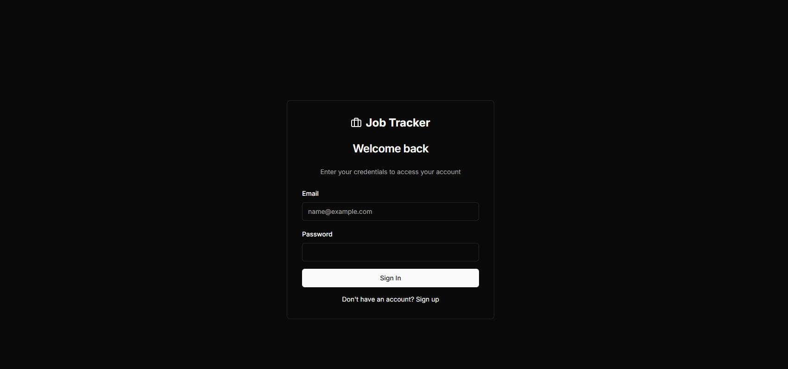
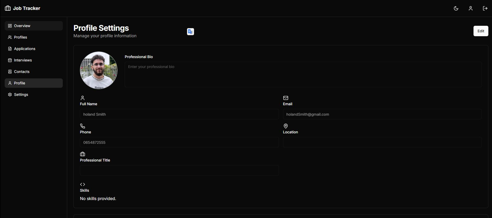
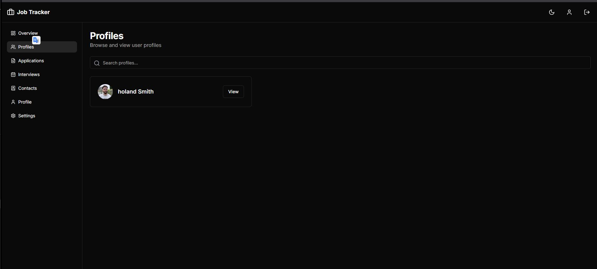
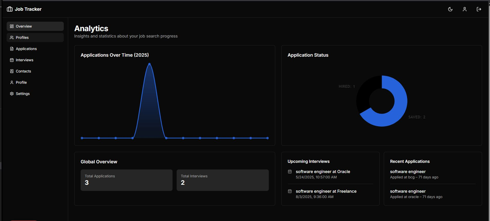
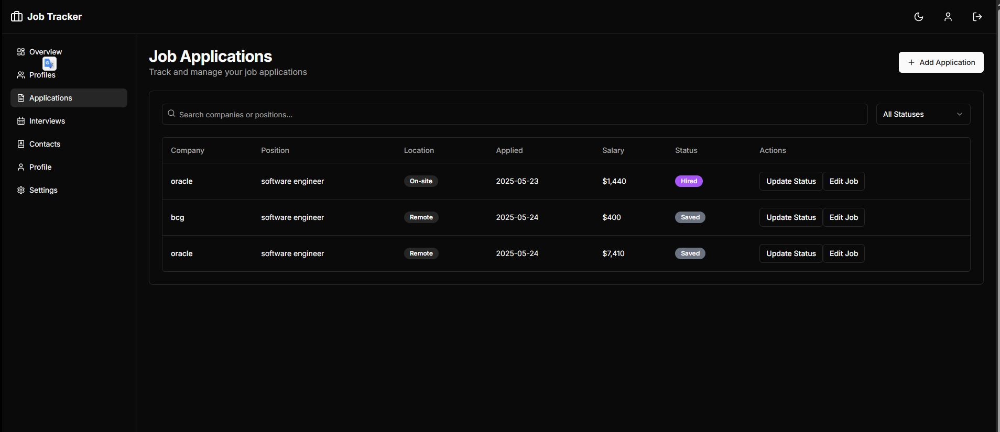
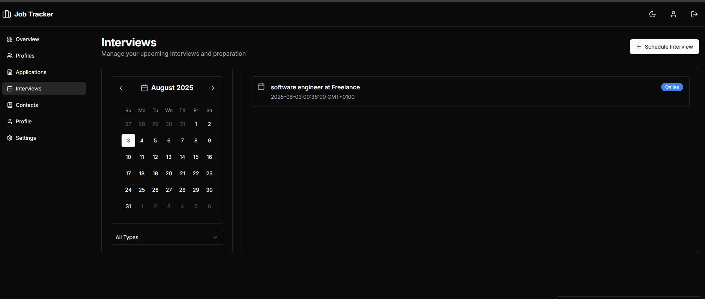
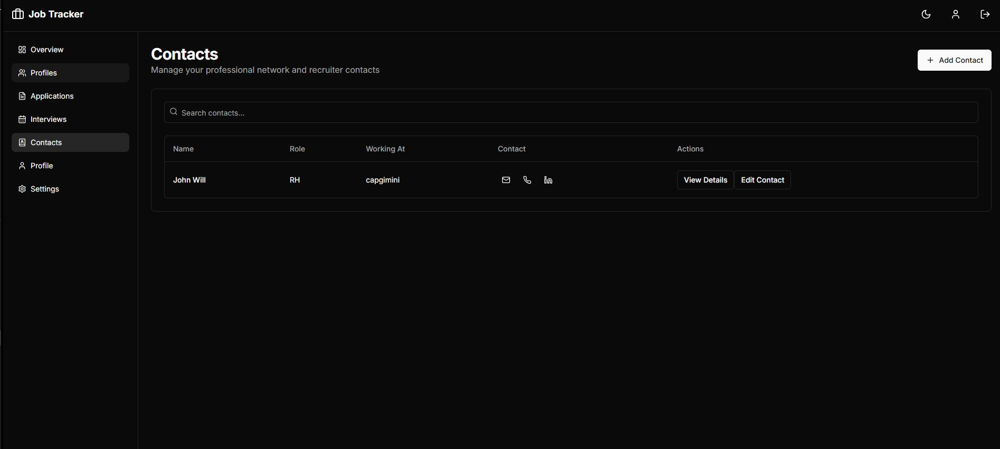
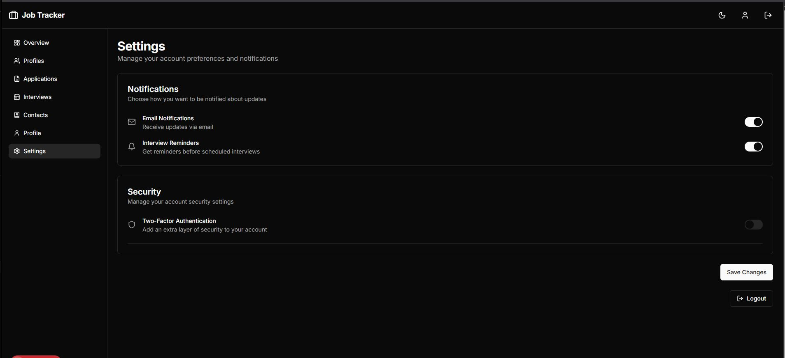
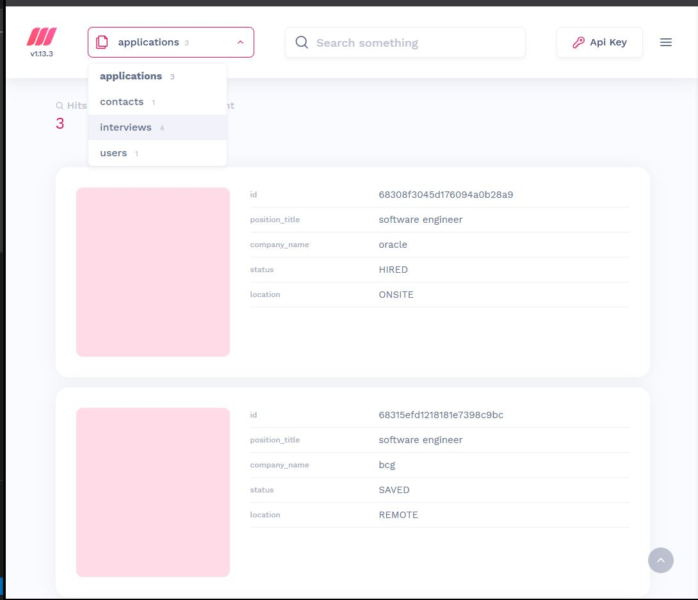
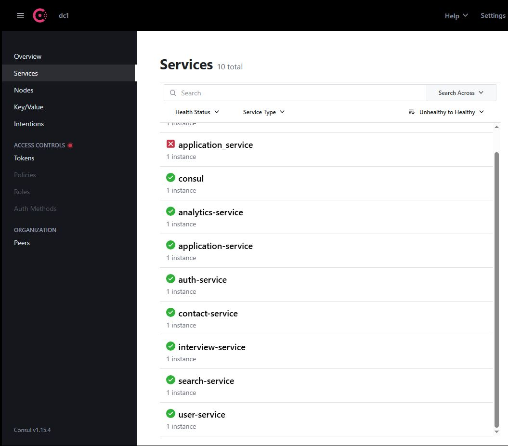

# JobTracker — Polyglot Microservices Platform

Full-stack job application management platform built as a **10-service polyglot microsystems** architecture. Features event-driven synchronization, CQRS-style search indexing, saga-based distributed transactions, and an API gateway mesh — all running on local infrastructure.

---

## Highlights

- **10 microservices** across 3 languages (Java/Spring Boot, Node.js/Express, TypeScript/Next.js)
- **Polyglot persistence:** PostgreSQL + MongoDB + Meilisearch
- **Event-driven architecture:** RabbitMQ topic exchange with 4 queue consumers
- **CQRS search pattern:** Write services publish events; search service consumes and indexes in Meilisearch
- **Saga pattern:** Compensating transactions across service boundaries (user delete cascades to auth)
- **API gateway mesh:** Kong with JWT RS256 validation, CORS, and route abstraction
- **Service discovery:** HashiCorp Consul with health-check-based registration

---

## Architecture

```
Frontend (Next.js 14)
    |
Kong API Gateway (JWT validation, routing, CORS)
    |
    +-- Auth Service (Java/Spring Boot + PostgreSQL)  :5000
    +-- User Service (Node.js/Express + MongoDB)      :5001
    +-- Application Service (Node.js/Express + MongoDB):5002
    +-- Interview Service (Java/Spring Boot + MongoDB) :5003
    +-- Contact Service (Java/Spring Boot + MongoDB)   :5004
    +-- Analytics Service (Node.js/Express + MongoDB)  :5005
    +-- Dashboard Service (Node.js/Express + MongoDB)  :5006
    +-- File Upload Service (Node.js/Express)          :5007
    +-- Notification Service (Node.js/Express + MongoDB):5008
    +-- Search Service (Node.js/Express + Meilisearch) :5009

Event Bus (RabbitMQ topic exchange)
    |
    +-- Search Service consumes: application.index, user_events, contact_queue, interview_queue
    +-- Analytics Service consumes: application.created/updated, interview.created/updated

Consul — service registration + health monitoring
```

---

## Tech Stack

### Frontend
| Layer | Technology |
|---|---|
| Framework | Next.js 14 + TypeScript (App Router) |
| UI | Radix UI + shadcn/ui + Tailwind CSS |
| Charts | Ant Design Charts |
| State | React Context API |
| Auth | JWT with refresh tokens |

### Backend Infrastructure
| Component | Technology |
|---|---|
| API Gateway | Kong 3.5 (DB-less, JWT plugin, CORS) |
| Service Discovery | HashiCorp Consul |
| Message Broker | RabbitMQ (topic exchange) |
| Search Engine | Meilisearch |

### Microservices

| Service | Language | Database | Pattern |
|---|---|---|---|
| Auth | Java 17 / Spring Boot | PostgreSQL | OAuth2 resource server, BCrypt |
| User | Node.js / Express 5 | MongoDB | Saga (compensating delete), event publish |
| Application | Node.js / Express 5 | MongoDB | CRUD + event publish |
| Interview | Java 17 / Spring Boot | MongoDB | CRUD + event publish |
| Contact | Java 17 / Spring Boot | MongoDB | CRUD + event publish |
| Analytics | Node.js / Express 5 | MongoDB | Event consumer, aggregate counters |
| Dashboard | Node.js / Express 5 | MongoDB | Event consumer, pre-computed views |
| File Upload | Node.js / Express 5 | Filesystem | Multer disk storage |
| Notification | Node.js / Express 5 | MongoDB | Event consumer |
| Search | Node.js / Express 4 | Meilisearch | Multi-queue consumer, CQRS indexing |

---

## Screenshots

<details>
<summary>Click to expand (8 screenshots)</summary>

| | |
|---|---|
|  |  |
|  |  |
|  |  |
|  |  |
|  |  |

</details>

---

## Quick Start

```bash
# 1. Infrastructure (Kong + Consul)
docker-compose up -d

# 2. Pick a service — see Backend/<service>/README.md for details
# Example: Application Service
cd Backend/application_service
npm install && npm start
```

Each microservice can be started independently. See individual service READMEs for environment setup and run commands.

### Access Points
| Service | URL |
|---|---|
| Frontend | http://localhost:3000 |
| Kong API | http://localhost:8000 |
| Consul UI | http://localhost:8500 |

---

## Architecture Patterns

### Event-Driven Synchronization
Write services (application, user, interview, contact) publish events to a RabbitMQ topic exchange on every create/update/delete. The search service and analytics service consume these events to keep indexes and aggregates current without synchronous coupling.

### Saga Pattern
The user delete operation demonstrates a compensating saga:
1. Delete user profile from MongoDB
2. Call auth service to remove the authentication record
3. Publish delete event to search index queue
4. **On failure:** Restore the user document (compensating transaction)

### CQRS for Search
Commands flow through CRUD services; queries for search go through Meilisearch via the search service. This decouples write-optimized MongoDB documents from read-optimized search indexes.

### API Gateway as Security Boundary
Kong validates RS256 JWT tokens at the gateway level before requests reach any backend service. Only the auth service (registration/login) bypasses JWT validation.

---

## Service Documentation

| Service | README |
|---|---|
| Auth | [Backend/auth_service](./Backend/auth_service/README.md) |
| User | [Backend/user_service](./Backend/user_service/README.md) |
| Application | [Backend/application_service](./Backend/application_service/README.md) |
| Interview | [Backend/interview_service](./Backend/interview_service/README.md) |
| Contact | [Backend/contact_service](./Backend/contact_service/README.md) |
| Analytics | [Backend/analytics_service](./Backend/analytics_service/README.md) |
| Dashboard | [Backend/dashboard_service](./Backend/dashboard_service/README.md) |
| File Upload | [Backend/fileUpload_service](./Backend/fileUpload_service/README.md) |
| Search | [Backend/search_service](./Backend/search_service/README.md) |
| Frontend | [Frontend](./Frontend/README.md) |

---

## License

MIT — see [LICENSE](LICENSE).
