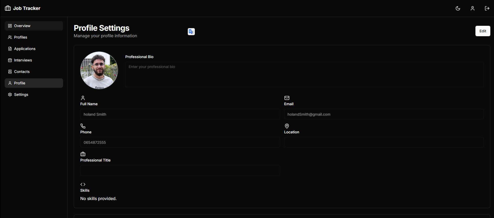
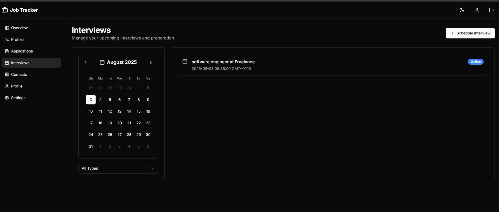
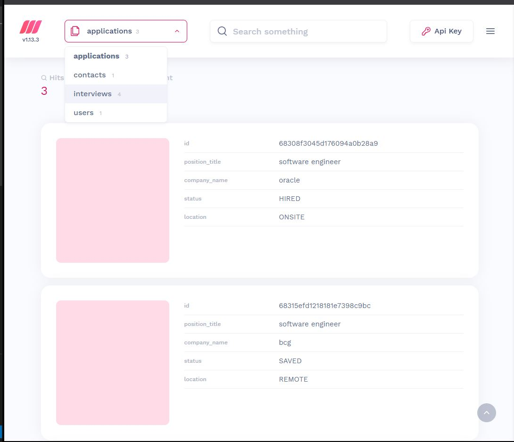

# 🗂️ Job Tracker Project

**Job Tracker** is a comprehensive full-stack microservices application that helps users manage job applications, interviews, profiles, and track their progress with real-time analytics. Built with modern technologies and designed for local development.

---

## 🛠️ Key Features

- **Job Applications Management:**  
  Add, track, update, and search job applications; manage statuses (applied, interview, offer, rejected, etc.)
- **Interview Management:**  
  Schedule and track interviews by date/type, with filtering and details for each session
- **User Profiles:**  
  Comprehensive user profiles with resume, skills, experience, and social/contact links
- **Search & Filter:**  
  Advanced search capabilities for applications, users, and companies with real-time filtering
- **Analytics:**  
  Visualize job search statistics with interactive charts and progress tracking
- **Contact Management:**  
  Manage professional contacts and networking connections

---

## 🏗️ Tech Stack & Architecture

### Frontend
- **Framework:** [Next.js 14](https://nextjs.org/) with TypeScript
- **UI Components:** [Radix UI](https://www.radix-ui.com/) + [Tailwind CSS](https://tailwindcss.com/)
- **Charts:** [Ant Design Charts](https://charts.ant.design/)
- **State Management:** React Context API
- **Authentication:** JWT-based authentication with refresh tokens

### Backend Microservices
- **Languages:** Java (Spring Boot), Python (Django), Node.js (Express)
- **Databases:**  
  - [PostgreSQL](https://www.postgresql.org/) (user authentication, interviews)
  - [MongoDB](https://www.mongodb.com/) (applications, analytics, contacts)
- **Message Queue:** [RabbitMQ](https://www.rabbitmq.com/) for async communication
- **Search Engine:** [Meilisearch](https://www.meilisearch.com/) for fast, typo-tolerant search
- **API Gateway:** [Kong](https://konghq.com/kong/) for request routing and API management
- **Service Discovery:** [Consul](https://www.consul.io/) for service registration and health checks

---

## 🖼️ Application Screenshots

### User Profiles & Authentication

*User authentication and registration interface*


*Detailed user profile management*


*User profiles overview and search*


### Analytics

*Comprehensive analytics with charts showing job search progress and statistics*

### Job Applications Management

*Job applications list with filtering, sorting, and status management*

### Interview Management

*Interview scheduling and tracking interface*

### Contact & Network Management

*Professional contact management and networking tools*

### Settings & Configuration

*Application settings and user preferences*

### Advanced Search

*Fast, typo-tolerant search across applications and profiles*

### Service Infrastructure

*Consul service discovery and health monitoring dashboard*

---

## 🕸️ Service Communication & Architecture

- **API Gateway:** [Kong](https://konghq.com/kong/) provides centralized request routing, rate limiting, and API management
- **Service Discovery:** [Consul](https://www.consul.io/) enables automatic service registration, health monitoring, and discovery
- **Message Queue:** [RabbitMQ](https://www.rabbitmq.com/) handles asynchronous communication between services
- **RESTful APIs:** Direct HTTP communication between services for real-time operations
- **Search:** [Meilisearch](https://www.meilisearch.com/) provides ultra-fast search capabilities across all data

---

## 📦 Microservices Overview

| Service | Technology | Port | Description |
|---------|------------|------|-------------|
| **Frontend** | Next.js 14 + TypeScript | 3000 | User interface and client-side application |
| **Auth Service** | Java + Spring Boot | 5000 | User authentication, JWT token management |
| **User Service** | Node.js + Express | 5001 | User profiles, skills, and social connections |
| **Application Service** | Python + Django | 5002 | Job application CRUD and status management |
| **Interview Service** | Java + Spring Boot | 5003 | Interview scheduling and tracking |
| **Search Service** | Node.js + Meilisearch | 5009 | Search and filtering across all data |
| **Analytics Service** | Node.js + Express | 5005 | Real-time metrics and dashboard data |
| **Contact Service** | Java + Spring Boot | 5004 | Professional contact management |
| **Dashboard Service** | Node.js + Express | 5006 | Dashboard data aggregation |
| **Kong Gateway** | Kong | 8000 | API Gateway (proxy/admin) |
| **Consul** | Consul | 8500 | Service discovery and health checks |

> **📁 See the [Backend](./Backend/) directory for detailed service documentation and setup instructions.**

---

## 🚀 Quick Start Guide

### Prerequisites
- [Node.js](https://nodejs.org/) (v18 or higher)
- [Python](https://www.python.org/) (v3.8 or higher)
- [Java](https://www.oracle.com/java/) (JDK 17 or higher)
- [Docker](https://docs.docker.com/get-docker/) and Docker Compose
- [MongoDB](https://www.mongodb.com/try/download/community)
- [PostgreSQL](https://www.postgresql.org/download/)

### 1. Clone the Repository
```bash
git clone https://github.com/ousaro/jobtrackerLocal.git
cd jobtrackerLocal
```

### 2. Start Infrastructure Services
Start Kong Gateway and Consul for service management:
```bash
# Start Kong and Consul using Docker Compose
docker-compose up -d
```

### 3. Start Individual Services

#### Backend Services
Each service can be started independently. Navigate to each service directory and follow the setup:

```bash
# Auth Service (Java Spring Boot)
cd Backend/auth_service
./mvnw spring-boot:run

# User Service (Node.js)
cd Backend/user_service
npm install
npm start

# Application Service (Python Django)
cd Backend/application_service
pip install -r requirements.txt
python runLocal.py

# Analytics Service (Node.js)
cd Backend/analytics_service
npm install
npm start

# Search Service (Node.js + Meilisearch)
cd Backend/search_service
npm install
docker-compose up -d # Start Meilisearch and rabbitmq
npm start

# Notification Service (Node.js)
cd Backend/notification_service
npm install
npm start

# Contact Service (Java Spring Boot)
cd Backend/contact_service
./mvnw spring-boot:run

# Interview Service (Java Spring Boot)
cd Backend/interview_service
./mvnw spring-boot:run

```

#### Frontend Application
```bash
cd Frontend
npm install
npm run dev
```

### 4. Access the Application
- **Frontend Application:** http://localhost:3000
- **Kong Gateway (API):** http://localhost:8000
- **Consul UI:** http://localhost:8500

---

## 🔧 Configuration & Environment

Each service requires specific environment variables. Check the individual service READMEs for detailed configuration:

### Common Environment Variables
- **Database connections** (MongoDB, PostgreSQL)
- **Service discovery** (Consul configuration)
- **Message queue** (RabbitMQ settings)
- **API keys and secrets**
- **Service ports and endpoints**

### Configuration Files
- `.env` files for each service (see `.env.example` templates)
- `docker-compose.yml` for infrastructure services
- `Kong/kong.yml` for API gateway configuration

---

## 📚 Documentation & Setup Guides

### Backend Services Documentation
- [Auth Service](./Backend/auth_service/README.md) - User authentication and JWT management
- [User Service](./Backend/user_service/README.md) - User profiles and social connections
- [Application Service](./Backend/application_service/README.md) - Job application management
- [Interview Service](./Backend/interview_service/README.md) - Interview scheduling and tracking
- [Search Service](./Backend/search_service/README.md) - Search and filtering functionality
- [Analytics Service](./Backend/analytics_service/README.md) - Real-time metrics and analytics
- [Contact Service](./Backend/contact_service/README.md) - Professional contact management

### Frontend Documentation
- [Frontend Application](./Frontend/README.md) - Next.js client application setup

---

## 🛠️ Development Guidelines

### Project Structure
- **Backend/**: All microservices organized by functionality
- **Frontend/**: Next.js application with TypeScript
- **Kong/**: API gateway configuration
- **ScreenShots/**: Application UI screenshots for documentation

### Service Communication
Services communicate through:
- RESTful HTTP APIs (synchronous)
- RabbitMQ message queues (asynchronous)
- Consul service discovery
- Kong API gateway routing

### Data Flow
1. Frontend → Kong Gateway → Backend Services
2. Services → RabbitMQ → Event handling
3. Services → Consul → Service registration/discovery
4. Services → Databases (MongoDB/PostgreSQL)

---

## 📄 License

This project is licensed under the MIT License - see the [LICENSE](LICENSE) file for details.

---